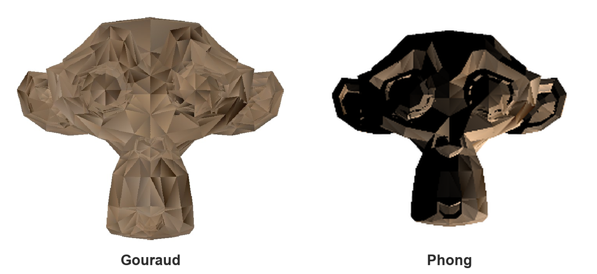
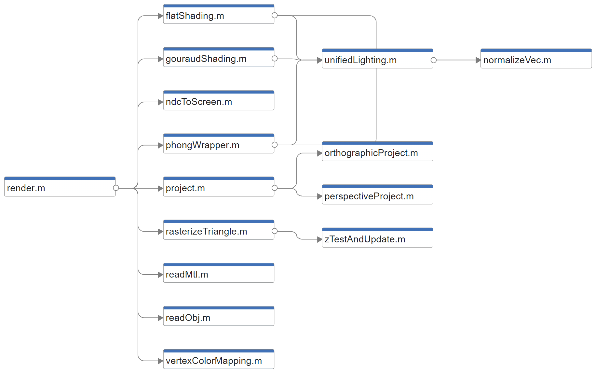

# gpu-zbuffer-renderer

围绕 **Z-buffer 隐藏面消除算法** 实现的两个轻量级渲染器：一个 **C/CUDA GPU 光栅化渲染器**，以及一个 **MATLAB 软件光栅化渲染管线**。

- CUDA 渲染器侧重展示 Z-buffer 算法的**并行性**——每个 GPU 线程负责一个像素，独立完成三角形覆盖判断与深度测试。
- MATLAB 渲染器侧重展示**完整的光栅化管线**（几何变换 → 投影 → 光栅化 → 深度测试 → 着色），代码模块化、便于阅读。

---

## 仓库结构

```
gpu-zbuffer-renderer/
├── cuda/                 # GPU Z-buffer 光栅化渲染器（C++/CUDA）
│   ├── src/renderer.cu
│   ├── assets/           # 示例 .obj 模型（monkey、cube）
│   └── CMakeLists.txt
├── matlab/               # 软件光栅化渲染管线（MATLAB）
│   ├── main.m            # 入口
│   ├── render.m          # 管线主流程
│   └── objs/  textures/  # 示例模型与贴图
└── docs/
    ├── shading_comparison.png # Suzanne：Gouraud vs Phong 着色对比
    └── matlab_modules.png     # MATLAB 渲染器模块依赖图
```

---

## CUDA 渲染器 (`cuda/`)

逐像素并行的 Z-buffer 光栅化渲染器。主机端加载 OBJ 模型、旋转、做正交投影映射到屏幕空间，并按面计算 Flat-Lambert 光照；GPU 端为**每个像素分配一个 CUDA 线程**，每个线程对所有三角形做重心坐标覆盖判断，并独立完成 **Z-buffer 深度测试**。

**特性**
- 每个输出像素对应一个线程，线程之间无需同步（每个像素只由一个线程写入）。
- 重心坐标（半平面）三角形覆盖判断，逐片元深度插值，Z-buffer 隐藏面消除。
- 无第三方依赖的极简 OBJ 加载器；按面 Flat-Lambert 着色。
- 输出 24 位 BMP（Windows 可直接打开）。
- 内置基准测试：对总耗时（核函数 + 设备到主机拷贝）取 6 次平均并打印 ms / FPS。

**构建**
```bash
# 使用 CMake（推荐）
cd cuda && cmake -B build && cmake --build build --config Release

# 或直接用 nvcc
cd cuda && nvcc -O2 src/renderer.cu -o renderer
```

**运行**
```bash
# 默认：assets/monkey.obj，1024x1024，输出 render.bmp
./renderer
# 自定义：模型、宽、高、输出文件
./renderer assets/cube.obj 1280 720 cube.bmp
```

**性能.** 程序会打印当前硬件上的实测耗时。在一块 **NVIDIA RTX 4060 Laptop** 上，早期实现的 Z-buffer 测试 6 次平均约为 **10.44 ms（约 96 FPS）**，可满足实时光栅化的一般响应需求。

> **说明.** 本仓库中的 CUDA 渲染器为重新实现的版本（早期代码未保留），沿用相同的“逐像素线程”设计与基准测试方法；实际耗时取决于 GPU、场景与分辨率。

---

## MATLAB 渲染器 (`matlab/`)

一个以可读性为目标的模块化软件光栅化管线，可将 OBJ 模型一路渲染为带光照的二维图像。下图为 **Suzanne** 模型在 Gouraud 与 Phong 两种着色模型下的渲染结果（可见 Phong 的高光与明暗过渡更细腻）：



**特性**
- OBJ/MTL 模型加载，支持贴图（`map_Kd`）到顶点颜色的映射。
- 透视投影**与**正交投影；NDC → 屏幕坐标映射。
- 逐三角形重心坐标光栅化，配合 **Z-buffer** 深度测试。
- 三种局部光照模型——**Flat**、**Gouraud**、**Phong**（Blinn-Phong）片元着色——可在 `main.m` 中切换。
- 遮挡与光照效果的可视化。

**运行**
```matlab
% 在 MATLAB 中，从 matlab/ 目录运行：
main        % 在 main.m 顶部修改 objFilename / shadingMethod / camera / light
```

**模块结构**

`render.m` 驱动整条管线，各功能拆分为独立模块（模型加载、投影、光栅化、深度测试、三种着色等）：



---

## 许可证与致谢

示例模型（`monkey` / Suzanne、`cube`）来自 Blender。本项目以 [MIT 许可证](LICENSE) 发布。
